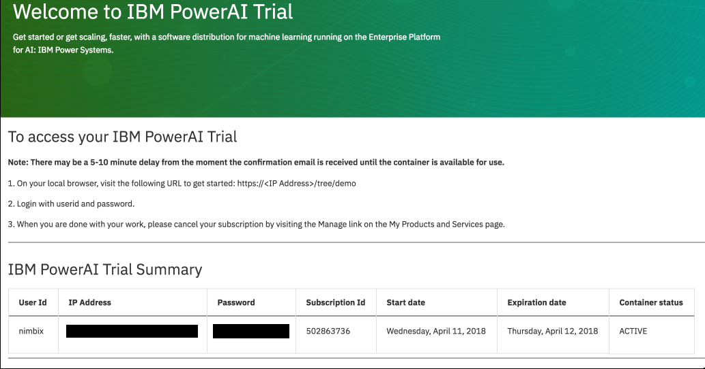

# TensorFlow Inception 및 전이 학습을 사용한 이미지 인식 학습

전이 학습(transfer learning)은 사전에 훈련 된 모델 (다른 사람에 의해 이미 대규모 데이터 세트를 기반으로 한 학습을 통해 도출된 네트워크의 가중치 및 변수)에, 자신의 데이터 세트로 모델을 미세 조정하는 프로세스입니다. 사전 훈련된 모델로 특징을 추출 (feature extraction)하고, 네트워크의 마지막 레이어를 (문제 공간의 성격에 따라) 본인의 분류기로 바꿉니다. (경사 하강법 (gradient descent) 최적화 과정 동안 가중치를 변경하지 않음으로써) 다른 모든 계층의 가중치를 고정하고 네트워크를 학습합니다. 본 예제에서는, 이미지 분류를 위해 사전 학습된 Inception-v3 모델을 사용했습니다. 이 모델은 두 부분으로 구성됩니다.:
- 컨볼루션 신경망을 활용한 특징 추출
- 완전 연결 (fully connected)레이어와 소프트맥스(softmax) 레이어로 분류

사전 학습된 Inception-v3 모델은 1,000 개의 클래스로 일반 객체를 인식 할 수 있는 최첨단 정확도를 제공합니다. 모델은 우선 입력 이미지로 부터 특징을 추출하고 그러한 특징을 기반으로 분류합니다. 우리는 이 사전 학습된 모델을 기반으로 하여 수영장이 딸린 주택과, 그렇지 않은 주택을 분류하기 위한 추가 학습을 합니다.


## 단계
1. PowerAI 에 제공되는 노트북을 로드합니다.
2. 사용할 예제 이미지는 수영장이 있는 집과 없는 집을 인식하는 활용을 보여줍니다.
3. 노트북은 TensorFlow Inception 모델과 재학습 예제를 통해 기존 모델을 활용하여 새로운 분류기를 만듭니다.
4. 노트북은 원래 모델과 새 모델을 비교하여 보여줍니다.

## 구성 요소

* [IBM Power AI](https://www.ibm.com/ms-en/marketplace/deep-learning-platform): 가장 많이 사용되는 기계 학습 프레임 워크가 포함된 IBM Power Systems 기반 소프트웨어 플랫폼
* [IBM Power Systems](https://www-03.ibm.com/systems/power/): 오픈 기술 기반의 mission-critical 업무용으로 설계된 IBM의 Power Architecture 기반 서버군
* [Nimbix Cloud Computing Platform](https://www.nimbix.net/): 엔지니어, 과학자 및 개발자가 클라우드 상에서 대규모 시뮬레이션을 작성, 계산 및 분석 할 수 있는 HPC 및 클라우드 슈퍼 컴퓨팅 플랫폼

## 주요 기술

* [Jupyter Notebooks](http://jupyter.org/): 라이브 코드, 방정식, 시각화 내용 및 설명 텍스트가 포함 된 문서를 만들고 공유 할 수 있는 오픈 소스 웹 응용 프로그램
* [Tensorflow](https://www.tensorflow.org/): 데이터 흐름 그래프를 사용한 수치 계산을 위한 오픈 소스 소프트웨어 라이브러리

# 비디오 보기

[](https://www.youtube.com/watch?v=S3jdmKrERrE)

# 단계

이 코드 패턴을 따라 하시려면 다음 단계를 따르십시오. 단계는 아래에서 자세히 설명합니다.

1. [PowerAI 플랫폼 무료 24시간 사용 권한 받기](#1-powerai-플랫폼-무료-24시간-사용-권한-받기)
1. [Jupyter 노트북 액세스 및 시작](#2-jupyter-노트북-액세스-및-시작)
1. [노트북 실행](#3-노트북-실행)
1. [결과 분석](#4-결과-분석)
1. [저장 및 공유](#5-저장-및-공유)
1. [평가판 끝내기](#6-평가판-끝내기)

## 1. PowerAI 플랫폼 무료 24시간 사용 권한 받기

IBM은 Nimbix와 제휴하여 인공지능 개발자들이 PowerAI 플랫폼에서 24 시간의 무료 처리 시간을 제공하는 평가판 계정을 제공합니다. 다음 안내대로 진행하여 Nimbix에 등록하여 사용 권한을 받아 PowerAI 코드 패턴을 시험해보고 플랫폼을 살펴봅니다.

* 이 [링크](https://www.ibm.com/account/reg/us-en/login?formid=urx-19543)를 클릭하여 무료 평가판 계정을 등록합니다.

* 등록 환영 페이지나 확인 이메일로 사용할 수 있는 서버의 아이피 주소나 호스트 네임을 확인할 수 있습니다. 브라우저를 열어 `https://<아이피 주소>` 로 접속합니다.

* 등록 환영 페이지나 확인 이메일에 있는 사용자이름과 암호를 사용하여 로그인합니다.

  [](https://www.ibm.com/account/reg/us-en/login?formid=urx-19543)

## 2. Jupyter 노트북 액세스 및 시작

git clone을 사용하면 단일 명령으로 예제 노트북, 데이터 세트 및 학습 라이브러리를 다운로드 할 수 있습니다.

* ```New``` 풀다운 메뉴에서 ``Terminal``을 선택 하여 새 터미널 창을 엽니다.

  

* git repo를 복제하려면 다음 명령을 실행하십시오.:

  ```commandline
  git clone https://github.com/IBM/powerai-transfer-learning
  ```

  

* 완료되면 터미널을 종료하고 노트북 브라우저로 돌아갈 수 있습니다. ``Files`` 탭에서 클릭 ``powerai-transfer-learning``, ``notebooks``,  ``Classifying-House-And-Pool-Images.ipynb``를 선택하여 노트북을 엽니다.

  

## 3. 노트북 실행

노트가 실행될 때 실제로 일어나는 것은 노트의 각 코드 셀이 위에서 아래로 순서대로 실행된다는 것입니다.

각 코드 셀은 선택 가능하며 왼쪽 부분에 태그가 붙습니다. 태그 형식은 `In [x]:` 입니다. 노트북의 상태에 따라 `x` 값은 다음과 같습니다.:

* 공백: 셀이 한 번도 실행되지 않았음을 나타냅니다.
* 숫자: 해당 셀이 실행된 상대적인 순서를 나타냅니다.
* `*`: 셀이 현재 실행 중임을 나타냅니다.

노트북에서 코드 셀을 실행하는 데는 여러 가지 방법이 있습니다.:

* 한 번에 하나의 셀 실행.
  * 셀을 선택한 다음 툴바에서 `Play` 버튼을 누릅니다.
* 배치모드: 순서대로 실행.
  * `Cell` 메뉴 모음에 사용할 수 있는 몇 가지 옵션이 있습니다. 예를 들어, `Run All`을 통해 모든 셀을 모두 실행하거나, `Run All Below`을 통해 현재 셀 바로 아래 셀로 부터 가장 아래 마지막까지 계속 실행할 수 있습니다.


## 4. 결과 분석

"Main" 코드 셀을 실행하면 정확도가 빠르게 향상되는 학습 과정을 볼 수 있습니다. 마지막에는 최종 테스트 정확도가 표시되며, 통상 이 이미지들로 약 85 % 정도의 정확도를 보입니다.


우리는 학습 전과 후의 모델을 저장 하였는데, 노트북 하단의 예제 이미지에서 전후 결과를 비교해 보십시오.


결과를 보게 되면 전혀 구분을 못하는 상태에서 꽤 좋은 성공률로 진화 되었음을 확인할 수있습니다. 다른 이미지를 시도해보거나, 어떤 이미지들이 분류하는데 어려운지 알아 보는 것도 재미있을 수 있습니다.

## 5. 저장 및 공유

### 작업 저장 방법:

이 노트북은 Nimbix Cloud 서버에서 임시적으로 제공되는 환경으로 다음 옵션을 사용하여 작업을 저장하십시오.:

`File` 메뉴 아래에 다음과 같은 옵션이 있습니다.:

* `Download as...` 로컬 시스템에 노트북을 다운로드합니다.
* `Print Preview` 노트북의 현재 상태를 인쇄 할 수 있습니다.

## 6. 평가판 끝내기

모든 작업이 완료되면 ``My Products and Services`` 페이지의 `Manage` 링크에 들어가서 구독을 종료합니다.

# 문제 해결

[See DEBUGGING.md.](DEBUGGING.md)

# 링크

* [Demo on Youtube](https://www.youtube.com/watch?v=S3jdmKrERrE): Watch the video.
* [Cognitive discovery architecture](https://www.ibm.com/devops/method/content/architecture/cognitiveDiscoveryDomain2): Learn how this Code Pattern fits into the Cognitive discovery Reference Architecture.
* [How to Retrain Inception’s Final Layer for New Categories](https://www.tensorflow.org/tutorials/image_retraining): Tutorial shows how to run example script on your images.
* [Image Recognition](https://www.tensorflow.org/tutorials/image_recognition): Tutorial teaches how to use Inception-v3 and classify images in Python or C++.
* [Creating an image classifier on Android using TensorFlow](https://medium.com/@daj/creating-an-image-classifier-on-android-using-tensorflow-part-1-513d9c10fa6a): Three-part series about using TensorFlow to classify images.
* [Blog](https://developer.ibm.com/dwblog/2017/command-line-tools-watson-visual-recognition/): Learn about command-line tools for Watson Visual Recognition.
* [How to Build a Simple Image Recognition System with TensorFlow](http://www.wolfib.com/Image-Recognition-Intro-Part-1/): Get started in machine learning by building a system to recognize what it sees in an image.
* [Sample code](https://www.ibm.com/developerworks/java/library/cc-sample-code-image-classification-watson-node/index.html): Identify objects in an image with the Watson Visual Recognition service.


# 더 알아보기

* **Artificial Intelligence Code Patterns**: Enjoyed this Code Pattern? Check out our other [AI Code Patterns](https://developer.ibm.com/code/technologies/artificial-intelligence/).
* **Data Analytics Code Patterns**: Enjoyed this Code Pattern? Check out our other [Data Analytics Code Patterns](https://developer.ibm.com/code/technologies/data-science/)
* **AI and Data Code Pattern Playlist**: Bookmark our [playlist](https://www.youtube.com/playlist?list=PLzUbsvIyrNfknNewObx5N7uGZ5FKH0Fde) with all of our Code Pattern videos
* **Data Science Experience**: Master the art of data science with IBM's [Data Science Experience](https://datascience.ibm.com/)
* **PowerAI**: Get started or get scaling, faster, with a software distribution for machine learning running on the Enterprise Platform for AI: [IBM Power Systems](https://www.ibm.com/ms-en/marketplace/deep-learning-platform)

# 라이센스

[Apache 2.0](LICENSE)
