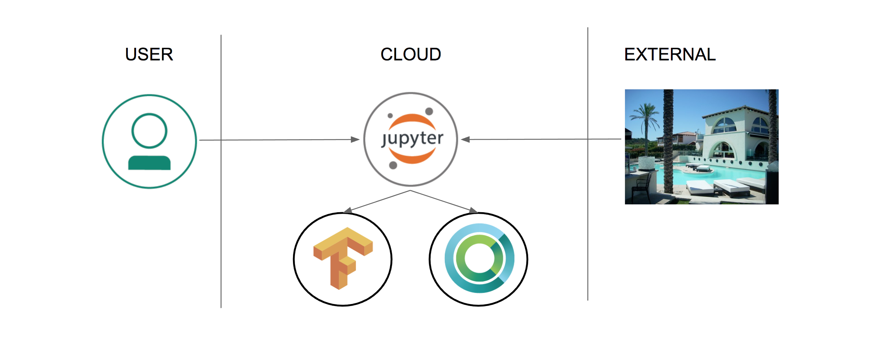

# TensorFlow Inception 및 전이 학습을 사용한 이미지 인식 학습

전이 학습(transfer learning)은 사전에 훈련 된 모델 (다른 사람에 의해 이미 대규모 데이터 세트를 기반으로 한 학습을 통해 도출된 네트워크의 가중치 및 변수)에, 자신의 데이터 세트로 모델을 미세 조정하는 프로세스입니다. 사전 훈련된 모델로 특징을 추출 (feature extraction)하고, 네트워크의 마지막 레이어를 (문제 공간의 성격에 따라) 본인의 분류기로 바꿉니다. (경사 하강법 (gradient descent) 최적화 과정 동안 가중치를 변경하지 않음으로써) 다른 모든 계층의 가중치를 고정하고 네트워크를 학습합니다. 본 예제에서는, 이미지 분류를 위해 사전 학습된 Inception-v3 모델을 사용했습니다. 이 모델은 두 부분으로 구성됩니다.:
- 컨볼루션 신경망을 활용한 특징 추출
- 완전 연결 (fully connected)레이어와 소프트맥스(softmax) 레이어로 분류

사전 학습된 Inception-v3 모델은 1,000 개의 클래스로 일반 객체를 인식 할 수 있는 최첨단 정확도를 제공합니다. 모델은 우선 입력 이미지로 부터 특징을 추출하고 그러한 특징을 기반으로 분류합니다. 우리는 이 사전 학습된 모델을 기반으로 하여 수영장이 딸린 주택과, 그렇지 않은 주택을 분류하기 위한 추가 학습을 합니다.




## 구성 요소

* [IBM Power AI](https://www.ibm.com/ms-en/marketplace/deep-learning-platform): 가장 많이 사용되는 기계 학습 프레임 워크가 포함된 IBM Power Systems 기반 소프트웨어 플랫폼
* [IBM Power Systems](https://www-03.ibm.com/systems/power/): 오픈 기술 기반의 mission-critical 업무용으로 설계된 IBM의 Power Architecture 기반 서버군
* [Nimbix Cloud Computing Platform](https://www.nimbix.net/): 엔지니어, 과학자 및 개발자가 클라우드 상에서 대규모 시뮬레이션을 작성, 계산 및 분석 할 수 있는 HPC 및 클라우드 슈퍼 컴퓨팅 플랫폼

## 주요 기술

* [Jupyter Notebooks](http://jupyter.org/): 라이브 코드, 방정식, 시각화 내용 및 설명 텍스트가 포함 된 문서를 만들고 공유 할 수 있는 오픈 소스 웹 응용 프로그램
* [Tensorflow](https://www.tensorflow.org/): 데이터 흐름 그래프를 사용한 수치 계산을 위한 오픈 소스 소프트웨어 라이브러리

# 비디오 보기

[](https://www.youtube.com/watch?v=S3jdmKrERrE)

# 단계

이 개발자 과정을 따라 하시려면 다음 단계를 따르십시오. 단계는 아래에서 자세히 설명합니다.

1. [PowerAI 플랫폼에의 24시간 무료 Access받기](#1-powerai-플랫폼에의-24시간-무료-access받기)
1. [Jupyter 노트북 액세스 및 시작](#2-jupyter-노트북-액세스-및-시작)
1. [노트북 실행](#3-노트북-실행)
1. [결과 분석](#4-결과-분석)
1. [저장 및 공유](#5-저장-및-공유)
1. [Trial 계정 사용 종료](#6-trial-계정-사용-종료)

## 1. PowerAI 플랫폼에의 24시간 무료 Access받기

IBM과 Nimbux의 파트너쉽으로 PowerAI 플랫폼에서의 24시간 무료 컴퓨팅 시간을 제공하는 평가판 계정이 이 과정을 따라하는 개발자 들에게 제공됩니다.
PowerAI Cognitive 코드 패턴 및 플래폼을 체험하기 위해 Nimbix에 등록하려면 다음 과정을 따르십시오.

* [IBM 마켓플레이스 PowerAI 포탈](https://www.ibm.com/us-en/marketplace/deep-learning-platform)를 방문하여 `Request Trial`을 클릭하십시오.

아래 화면과 같은 IBM PowerAI Trial 페이지에서 IBM Account 생성을 위해 필요한 정보를 입력하고 `Continue`를 클릭하십시오. 이미 IBM ID를 가지고 계시다면 `Already have an account? Log in`을 선택하고 계정 정보를 입력 후 `Continue`를 클릭하십시오.


아래 화면과 같은 **Almost there…** 페이지에서 필요한 정보를 입력하고 `Continue`를 클릭하면 등록이 완료됩니다. **IBM Marketplace Products and Services** 페이지를 여십시오.


**IBM Marketplace Products and Services** 페이지는 귀하가 사용할 수 있는 모든 Offering을 보여줍니다. PowerAI Trial이 이제 그 중 하나로 생성되어 있을 것입니다. PowerAI Trial 섹션에서 아래에 보이는 대로 `Launch` 를 클릭하면 **IBM PowerAI trial**페이지가 열립니다.


아래 화면처럼 **Welcome to IBM PowerAI Trial** 페이지는 Trial에 접근하기 위한 가이드를 제공합니다. 또는 귀하가 Trial을 시작할 수 있도록 유사한 가이드가 등록을 컨펌하는 이메일로 전달됩니다. 


Trial 계정으로 시작하는 과정 요약:

* 사용하고 계신 노트북에서 커맨드창을 열고 다음 명령을 수행하십시오. `{IP Address}`에는 Welcome페이지 또는 등록 컨펌 이메일에 명시된 IP 주소 또는 호스트네임을 입력하십시오.
  ```sh
  ssh -L 8888:localhost:8888 nimbix@{IP Address}
  ```

* 패스워드를 입력하라고 나오면 Welcome페이지 또는 등록 컨펌 이메일에 명시된 패스워드를 입력하십시오.
* 시작하려면 브라우저에서 다음 URL에 접속하십시오: http://localhost:8888/tree/.

## 2. Jupyter 노트북 액세스 및 시작

git clone을 사용하면 단일 명령으로 예제 노트북, 데이터 세트 및 학습 라이브러리를 다운로드 할 수 있습니다.

* ```New``` 풀다운 메뉴에서 ``Terminal``을 선택 하여 새 터미널 창을 엽니다.


* git repo를 복제하려면 다음 명령을 실행하십시오.:

```commandline
git clone https://github.com/IBM/powerai-transfer-learning
```


* 완료되면 터미널을 종료하고 노트북 브라우저로 돌아갈 수 있습니다. ``Files`` 탭에서 클릭 ``powerai-transfer-learning``, ``notebooks``,  ``Classifying-House-And-Pool-Images.ipynb``를 선택하여 노트북을 엽니다.


## 3. 노트북 실행

노트가 실행될 때 실제로 일어나는 것은 노트의 각 코드 셀이 위에서 아래로 순서대로 실행된다는 것입니다.

각 코드 셀은 선택 가능하며 왼쪽 부분에 태그가 붙습니다. 태그 형식은 `In [x]:` 입니다. 노트북의 상태에 따라 `x` 값은 다음과 같습니다.:

* 공백: 셀이 한 번도 실행되지 않았음을 나타냅니다.
* 숫자: 해당 셀이 실행된 상대적인 순서를 나타냅니다.
* `*`: 셀이 현재 실행 중임을 나타냅니다.

노트북에서 코드 셀을 실행하는 데는 여러 가지 방법이 있습니다.:

* 한 번에 하나의 셀 실행.
  * 셀을 선택한 다음 툴바에서 `Play` 버튼을 누릅니다.
* 배치모드: 순서대로 실행.
  * `Cell` 메뉴 모음에 사용할 수 있는 몇 가지 옵션이 있습니다. 예를 들어, `Run All`을 통해 모든 셀을 모두 실행하거나, `Run All Below`을 통해 현재 셀 바로 아래 셀로 부터 가장 아래 마지막까지 계속 실행할 수 있습니다.


## 4. 결과 분석

"Main" 코드 셀을 실행하면 정확도가 빠르게 향상되는 학습 과정을 볼 수 있습니다. 마지막에는 최종 테스트 정확도가 표시되며, 통상 이 이미지들로 약 85 % 정도의 정확도를 보입니다.


우리는 학습 전과 후의 모델을 저장 하였는데, 노트북 하단의 예제 이미지에서 전후 결과를 비교해 보십시오.


결과를 보게 되면 전혀 구분을 못하는 상태에서 꽤 좋은 성공률로 진화 되었음을 확인할 수있습니다. 다른 이미지를 시도해보거나, 어떤 이미지들이 분류하는데 어려운지 알아 보는 것도 재미있을 수 있습니다.

## 5. 저장 및 공유

### 작업 저장 방법:

이 노트북은 Nimbix Cloud 서버에서 임시적으로 제공되는 환경으로 다음 옵션을 사용하여 작업을 저장하십시오.:

`File` 메뉴 아래에 다음과 같은 옵션이 있습니다.:

* `Download as...` 로컬 시스템에 노트북을 다운로드합니다.
* `Print Preview` 노트북의 현재 상태를 인쇄 할 수 있습니다.

## 6. Trial 계정 사용 종료

실습을 마친 후에는 ssh session에서 다음 명령을 실행하거나 **My Products and Services**페이지에 있는 `Manage` 링크를 통해 Trial계정을 종료시켜 주십시오.

```sh
sudo poweroff --force
```

# 문제 해결

[See DEBUGGING.md.](DEBUGGING.md)

# 라이센스

[Apache 2.0](LICENSE)
