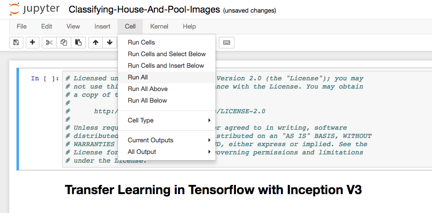

# TensorFlow Inception 및 전이 학습을 사용한 이미지 인식 학습

전이 학습(transfer learning)은 사전에 훈련 된 모델 (다른 사람에 의해 이미 대규모 데이터 세트를 기반으로 한 학습을 통해 도출된 네트워크의 가중치 및 변수)에, 자신의 데이터 세트로 모델을 미세 조정하는 프로세스입니다. 사전 훈련된 모델로 특징을 추출 (feature extraction)하고, 네트워크의 마지막 레이어를 (문제 공간의 성격에 따라) 본인의 분류기로 바꿉니다. (경사 하강법 (gradient descent) 최적화 과정 동안 가중치를 변경하지 않음으로써) 다른 모든 계층의 가중치를 고정하고 네트워크를 학습합니다. 본 예제에서는, 이미지 분류를 위해 사전 학습된 Inception-v3 모델을 사용했습니다. 이 모델은 두 부분으로 구성됩니다.:
- 컨볼루션 신경망을 활용한 특징 추출
- 완전 연결 (fully connected)레이어와 소프트맥스(softmax) 레이어로 분류

사전 학습된 Inception-v3 모델은 1,000 개의 클래스로 일반 객체를 인식 할 수 있는 최첨단 정확도를 제공합니다. 모델은 우선 입력 이미지로 부터 특징을 추출하고 그러한 특징을 기반으로 분류합니다. 우리는 이 사전 학습된 모델을 기반으로 하여 수영장이 딸린 주택과, 그렇지 않은 주택을 분류하기 위한 추가 학습을 합니다.


## 구성 요소

* [IBM Power AI](https://www.ibm.com/ms-en/marketplace/deep-learning-platform): 가장 많이 사용되는 기계 학습 프레임 워크가 포함된 IBM Power Systems 기반 소프트웨어 플랫폼
* [IBM Power Systems](https://www-03.ibm.com/systems/power/): 오픈 기술 기반의 mission-critical 업무용으로 설계된 IBM의 Power Architecture 기반 서버군
* [Nimbix Cloud Computing Platform](https://www.nimbix.net/): 엔지니어, 과학자 및 개발자가 클라우드 상에서 대규모 시뮬레이션을 작성, 계산 및 분석 할 수 있는 HPC 및 클라우드 슈퍼 컴퓨팅 플랫폼

## 주요 기술

* [Jupyter Notebooks](http://jupyter.org/): 라이브 코드, 방정식, 시각화 내용 및 설명 텍스트가 포함 된 문서를 만들고 공유 할 수 있는 오픈 소스 웹 응용 프로그램
* [Tensorflow](https://www.tensorflow.org/): 데이터 흐름 그래프를 사용한 수치 계산을 위한 오픈 소스 소프트웨어 라이브러리

# 비디오 보기

[](https://www.youtube.com/watch?v=S3jdmKrERrE)

# 단계

Follow these steps to setup and run this developer journey. The steps are
described in detail below.

1. [Register for a Trial Nimbix Cloud Platform account](#1-register-for-a-trial-nimbix-cloud-platform-account)
2. [Navigating the Nimbix UI](#2-navigating-the-nimbix-ui)
3. [Deploy and run the PowerAI Notebooks application](#3-deploy-and-run-the-powerai-notebooks-application)
4. [Access and start the Jupyter notebook](#4-access-and-start-the-jupyter-notebook)
5. [Run the notebook](#5-run-the-notebook)
6. [Analyze the results](#6-analyze-the-results)
7. [Save and share](#7-save-and-share)
8. [Shut down the PowerAI Notebooks job](#8-shut-down-the-powerai-notebooks-job)

## 1. Register for a Trial Nimbix Cloud Platform account

IBM has partnered with Nimbix to provide journey developers a trial
account that provides 10 hours of free processing time on the PowerAI
platform.

The registration process is as follows:

* Go to the [IBM Cognitive Journey Demo Registration Page](https://www.nimbix.net/cognitive-journey)
and submit the form to initiate the registration process.


* Wait for a confirmation email. Note that this process is not automated so
it may take up to 24 hours to be reviewed and approved.
* Once you receive the email, you will have 24 hours to complete the process
by clicking on the provided link:


* The above link will take you to this page where you need to create and
confirm your account password:


> *NOTE:* A "Promotional Code" is not required.

* Wait for a confirmation email that will will provide instructions
for logging into Nimbix:


* Click the [link](https://mc.jarvice.com?page=compute&team) to take you to
the Nimbix login page:


## 2. Navigating the Nimbix UI

The Nimbix UI has two main controls located at the top of the panel.


* Click on ``NIBMIX`` to display a drop-down list of available modes. Click
again to hide the list. In the example view above, we have selected
the ``Dashboard`` mode.

* On the left-side, click on the ``collapsible`` icon to display a
drop-down list of views that are associated with the selected mode.
Click on the icon again to hide the list. In the example above, we have
selected the ``Current Jobs`` dashboard view.

## 3. Deploy and run the PowerAI Notebooks application

Once signed into Nimbix, deploy the PowerAI Notebooks application.

* Search for and select the ``PowerAI Notebooks`` application in the list
of available apps in the ``Compute:All Applications`` view.


* From the ``PowerAI Notebooks`` application panel, click the
``TensorFlow`` button:


* From the ``TensorFlow`` configuration panel, accept all default values and
click the ``Submit`` button:


> *NOTE:* Ignore the $/hr charge listed. With your trial account you receive 10 hours of free processing time.

* Once started, the following ``Dashboard`` panel will be displayed. When
the server ``Status`` turns to ``Processing``, the server is ready to be
accessed.

    Click on ``(click to show)`` to get the password.

* Click ``Click here to connect`` to launch web access to the notebooks.


* Log-in using the user name ``nimbix`` and the previously supplied password.


## 4. Access and start the Jupyter notebook

Use git clone to download the example notebook, dataset, and retraining library with a single command.

* Get a new terminal window by clicking on the ```New``` pull-down and selecting ``Terminal``.


* Run the following command to clone the git repo:

```commandline
git clone https://github.com/IBM/powerai-transfer-learning
```


* Once done, you can exit the terminal and return to the notebook browser. Use the ``Files`` tab and click on ``powerai-transfer-learning`` then ``notebooks`` and then ``Classifying-House-And-Pool-Images.ipynb`` to open the notebook.


## 5. Run the notebook

When a notebook is executed, what is actually happening is that each code cell in
the notebook is executed, in order, from top to bottom.

Each code cell is selectable and is preceded by a tag in the left margin. The tag
format is `In [x]:`. Depending on the state of the notebook, the `x` can be:

* A blank, this indicates that the cell has never been executed.
* A number, this number represents the relative order this code step was executed.
* A `*`, this indicates that the cell is currently executing.

There are several ways to execute the code cells in your notebook:

* One cell at a time.
  * Select the cell, and then press the `Play` button in the toolbar.
* Batch mode, in sequential order.
  * From the `Cell` menu bar, there are several options available. For example, you
    can `Run All` cells in your notebook, or you can `Run All Below`, that will
    start executing from the first cell under the currently selected cell, and then
    continue executing all cells that follow.



## 6. Analyze the results

When you run the "Main" code cell you can watch the training as the accuracy
quickly improves. At the end, the final test accuracy is shown. We usually see
somewhere around 85% accuracy with these images.


We captured the model before and after the training. Look at our example
images at the bottom of the notebook and see our before and after results.


The results should go from no recognition ability at all to a pretty good
success rate. You might find it interesting to try different images and see
if you can identify why it has more difficulty classifying some images.

## 7. Save and share

### How to save your work:

Because this notebook is running temporarily on a Nimbix
Cloud server, use the following options to save your work:

Under the `File` menu, there are options to:

* `Download as...` will download the notebook to your local system.
* `Print Preview` will allow you to print the current state of the
  notebook.

## 8. Shut down the PowerAI Notebooks job

Remember to shutdown the server to free up resources on the Nimbix Cloud Platform. Also, remember that
the free trial registration only provides 10 hours of compute time.

* From the Nimbix ``Dashboard:Current Jobs`` view, click on the
``Shutdown`` button and confirm.

# 문제 해결

[See DEBUGGING.md.](DEBUGGING.md)

# 라이센스

[Apache 2.0](LICENSE)
