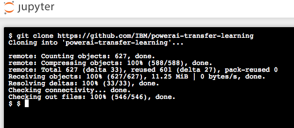

# TensorFlow Inception 및 전이 학습을 사용한 이미지 인식 학습

전이 학습(transfer learning)은 사전에 훈련 된 모델 (다른 사람에 의해 이미 대규모 데이터 세트를 기반으로 한 학습을 통해 도출된 네트워크의 가중치 및 변수)에, 자신의 데이터 세트로 모델을 미세 조정하는 프로세스입니다. 사전 훈련된 모델로 특징을 추출 (feature extraction)하고, 네트워크의 마지막 레이어를 (문제 공간의 성격에 따라) 본인의 분류기로 바꿉니다. (경사 하강법 (gradient descent) 최적화 과정 동안 가중치를 변경하지 않음으로써) 다른 모든 계층의 가중치를 고정하고 네트워크를 학습합니다. 본 예제에서는, 이미지 분류를 위해 사전 학습된 Inception-v3 모델을 사용했습니다. 이 모델은 두 부분으로 구성됩니다.:
- 컨볼루션 신경망을 활용한 특징 추출
- 완전 연결 (fully connected)레이어와 소프트맥스(softmax) 레이어로 분류

사전 학습된 Inception-v3 모델은 1,000 개의 클래스로 일반 객체를 인식 할 수 있는 최첨단 정확도를 제공합니다. 모델은 우선 입력 이미지로 부터 특징을 추출하고 그러한 특징을 기반으로 분류합니다. 우리는 이 사전 학습된 모델을 기반으로 하여 수영장이 딸린 주택과, 그렇지 않은 주택을 분류하기 위한 추가 학습을 합니다.


## 구성 요소

* [IBM Power AI](https://www.ibm.com/ms-en/marketplace/deep-learning-platform): 가장 많이 사용되는 기계 학습 프레임 워크가 포함된 IBM Power Systems 기반 소프트웨어 플랫폼
* [IBM Power Systems](https://www-03.ibm.com/systems/power/): 오픈 기술 기반의 mission-critical 업무용으로 설계된 IBM의 Power Architecture 기반 서버군
* [Nimbix Cloud Computing Platform](https://www.nimbix.net/): 엔지니어, 과학자 및 개발자가 클라우드 상에서 대규모 시뮬레이션을 작성, 계산 및 분석 할 수 있는 HPC 및 클라우드 슈퍼 컴퓨팅 플랫폼

## 주요 기술

* [Jupyter Notebooks](http://jupyter.org/): 라이브 코드, 방정식, 시각화 내용 및 설명 텍스트가 포함 된 문서를 만들고 공유 할 수 있는 오픈 소스 웹 응용 프로그램
* [Tensorflow](https://www.tensorflow.org/): 데이터 흐름 그래프를 사용한 수치 계산을 위한 오픈 소스 소프트웨어 라이브러리

# 비디오 보기

[](https://www.youtube.com/watch?v=S3jdmKrERrE)

# 단계

이 개발자 과정을 따라 하시려면 다음 단계를 따르십시오. 단계는 아래에서 자세히 설명합니다.

1. [Nimbix Cloud Platform 평가판 계정 등록](#1-nimbix-cloud-platform-평가판-계정-등록)
2. [Nimbix UI 탐색](#2-nimbix-ui-탐색)
3. [PowerAI 노트북 응용 프로그램 배포 및 실행](#3-powerai-노트북-응용-프로그램-배포-및-실행)
4. [Jupyter 노트북 액세스 및 시작](#4-jupyter-노트북-액세스-및-시작)
5. [노트북 실행](#5-노트북-실행)
6. [결과 분석](#6-결과-분석)
7. [저장 및 공유](#7-저장-및-공유)
8. [PowerAI 노트북 작업 종료](#8-powerai-노트북-작업-종료)

## 1. Nimbix Cloud Platform 평가판 계정 등록

IBM은 Nimbix와 제휴하여 PowerAI 플랫폼에서 10 시간의 무료 처리 시간을 제공하는 평가판 계정을 제공합니다.

등록 절차는 다음과 같습니다.:

* [IBM Cognitive Journey Demo Registration Page](https://www.nimbix.net/cognitive-journey)로 이동하여 양식을 제출하여 등록 프로세스를 시작하십시오.


* 등록 확인 이메일을 기다립니다. 이 프로세스는 자동화되어 있지 않으므로 검토하고 승인하는 데 최대 24 시간이 걸릴 수 있습니다.
* 이메일을 받으면 제공된 링크를 24시간 이내에 클릭하여 다음의 과정을 마칩니다.


* 위의 링크를 클릭하면 계정 비밀번호를 만들고 확인하는 페이지로 이동합니다.:


> *NOTE:* 프로모션 코드"는 필요하지 않습니다.

* Nimbix에 로그인하는 방법을 알려주는 확인 이메일을 기다립니다.:


* [link](https://mc.jarvice.com?page=compute&team)를 클릭하면 Nimbix 로그인 페이지로 이동합니다.:


## 2. Nimbix UI 탐색

Nimbix UI에는 패널 맨 위에 두 개의 기본 컨트롤이 있습니다.


* 사용 가능한 모드의 드롭 다운 목록을 표시 하려면 ``NIBMIX``를 클릭하십시오. 목록을 숨기려면 다시 클릭하십시오. 위의 예제보기에서는 ``Dashboard``  모드를 선택했습니다.

* 왼쪽에서 ``collapsible`` 아이콘을 클릭 하면 선택한 모드와 관련된 보기의 드롭 다운 목록이 표시됩니다. 목록을 숨기려면 아이콘을 다시 클릭하십시오. 위의 예에서는 ``Current Jobs`` 대시 보드 보기를 선택했습니다.

## 3. PowerAI 노트북 응용 프로그램 배포 및 실행

Nimbix에 로그인하면 PowerAI 노트북 응용 프로그램을 배포하십시오.

* ``Compute:All Applications`` 메뉴의 사용 가능한 앱 목록 에서 ``PowerAI Notebooks`` 애플리케이션을 검색하고 선택하십시오.


* ``PowerAI Notebooks` 어플리케이션 패널에서, ``TensorFlow``를 클릭합니다.:


* ``TensorFlow``구성 패널에서, 모든 기본 값을 적용하고 ``Submit``버튼을 클릭 합니다:


> *NOTE:* 나열된 $/시간당 요금은 무시하십시오. 평가판 계정에 10 시간의 무료 처리 시간이 부여됩니다.

* 시작되면 다음 ``Dashboard` 패널이 표시됩니다. 서버 ``Status`가 ``Processing`로 바뀌면 서버에 액세스 할 수 있습니다.
    ``(click to show)``를 클릭하여 암호를 확인합니다.

* ``Click here to connect`` 를 클릭하면 웹을 통하여 노트북에 접속하게 됩니다.


* 사용자 이름 nimbix와 이전에 제공된 암호를 사용하여 로그인하십시오.


## 4. Jupyter 노트북 액세스 및 시작

git clone을 사용하면 단일 명령으로 예제 노트북, 데이터 세트 및 학습 라이브러리를 다운로드 할 수 있습니다.

* ```New``` 풀다운 메뉴에서 ``Terminal``을 선택 하여 새 터미널 창을 엽니다.


* git repo를 복제하려면 다음 명령을 실행하십시오.:

```commandline
git clone https://github.com/IBM/powerai-transfer-learning
```



* 완료되면 터미널을 종료하고 노트북 브라우저로 돌아갈 수 있습니다. ``Files`` 탭에서 클릭 ``powerai-transfer-learning``, ``notebooks``,  ``Classifying-House-And-Pool-Images.ipynb``를 선택하여 노트북을 엽니다.


## 5. 노트북 실행

노트가 실행될 때 실제로 일어나는 것은 노트의 각 코드 셀이 위에서 아래로 순서대로 실행된다는 것입니다.

각 코드 셀은 선택 가능하며 왼쪽 부분에 태그가 붙습니다. 태그 형식은 `In [x]:` 입니다. 노트북의 상태에 따라 `x` 값은 다음과 같습니다.:

* 공백: 셀이 한 번도 실행되지 않았음을 나타냅니다.
* 숫자: 해당 셀이 실행된 상대적인 순서를 나타냅니다.
* `*`: 셀이 현재 실행 중임을 나타냅니다.

노트북에서 코드 셀을 실행하는 데는 여러 가지 방법이 있습니다.:

* 한 번에 하나의 셀 실행.
  * 셀을 선택한 다음 툴바에서 `Play` 버튼을 누릅니다.
* 배치모드: 순서대로 실행.
  * `Cell` 메뉴 모음에 사용할 수 있는 몇 가지 옵션이 있습니다. 예를 들어, `Run All`을 통해 모든 셀을 모두 실행하거나, `Run All Below`을 통해 현재 셀 바로 아래 셀로 부터 가장 아래 마지막까지 계속 실행할 수 있습니다.


## 6. 결과 분석

"Main" 코드 셀을 실행하면 정확도가 빠르게 향상되는 학습 과정을 볼 수 있습니다. 마지막에는 최종 테스트 정확도가 표시되며, 통상 이 이미지들로 약 85 % 정도의 정확도를 보입니다.


우리는 학습 전과 후의 모델을 저장 하였는데, 노트북 하단의 예제 이미지에서 전후 결과를 비교해 보십시오.


결과를 보게 되면 전혀 구분을 못하는 상태에서 꽤 좋은 성공률로 진화 되었음을 확인할 수있습니다. 다른 이미지를 시도해보거나, 어떤 이미지들이 분류하는데 어려운지 알아 보는 것도 재미있을 수 있습니다.

## 7. 저장 및 공유

### 작업 저장 방법:

이 노트북은 Nimbix Cloud 서버에서 임시적으로 제공되는 환경으로 다음 옵션을 사용하여 작업을 저장하십시오.:

`File` 메뉴 아래에 다음과 같은 옵션이 있습니다.:

* `Download as...` 로컬 시스템에 노트북을 다운로드합니다.
* `Print Preview` 노트북의 현재 상태를 인쇄 할 수 있습니다.

## 8. PowerAI 노트북 작업 종료

Nimbix Cloud Platform에서 리소스를 확보 하려면 서버를 종료해야합니다. 또한 무료 평가판 계정은 10 시간의 계산 시간만을 제공합니다.

* Nimbix ``Dashboard:Current Jobs`` 보기에서, ``Shutdown`` 버튼을 클릭하고 확인 합니다.

# 문제 해결

[See DEBUGGING.md.](DEBUGGING.md)

# 라이센스

[Apache 2.0](LICENSE)
