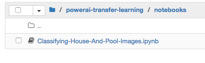

# Image recognition training with TensorFlow Inception and transfer learning

*Read this in other languages: [한국어](README-ko.md).*

Transfer learning is the process of taking a pre-trained model (the weights and parameters of a network that has been trained on a large dataset by somebody else) and “fine-tuning” the model with your own dataset. The idea is that this pre-trained model will act as a feature extractor. You will remove the last layer of the network and replace it with your own classifier (depending on what your problem space is). You then freeze the weights of all the other layers and train the network normally (Freezing the layers means not changing the weights during gradient descent/optimization).
For this experiment we used Google's Inception-V3 pretrained model for Image Classification. This model consists of two parts:
- Feature extraction part with a convolutional neural network.
- Classification part with fully-connected and softmax layers.

The pre-trained Inception-v3 model achieves state-of-the-art accuracy for recognizing general objects with 1000 classes. The model extracts general features from input images in the first part and classifies them based on those features in the second part.
We will use this pre-trained model and re-train it it to classify houses with or without swimming pools.


## Flow
1. The developer loads the provided notebook, which is run on a PowerAI system.
2. A provided example dataset demonstrates a use case of recognizing images of houses with pools vs. houses without pools.
3. The notebook uses the TensorFlow Inception model and retraining example to leverage the existing model and build a custom classifier.
4. The notebook compares results using the original model and the new model.

## Included components

* [IBM Power AI](https://www.ibm.com/ms-en/marketplace/deep-learning-platform): A software platform that includes the most popular machine learning frameworks with IBM Power Systems.
* [IBM Power Systems](https://www-03.ibm.com/systems/power/): IBM Power Systems is IBM's Power Architecture-based server line, built with open technologies and designed for mission-critical applications.
* [Nimbix Cloud Computing Platform](https://www.nimbix.net/): An HPC & Cloud Supercomputing platform enabling engineers, scientists & developers, to build, compute, analyze, and scale simulations in the cloud

## Featured technologies

* [Jupyter Notebooks](http://jupyter.org/): An open-source web application that allows you to create and share documents that contain live code, equations, visualizations and explanatory text.
* [Tensorflow](https://www.tensorflow.org/): An open source software library for numerical computation using data flow graphs.

# Watch the Video

[](https://www.youtube.com/watch?v=S3jdmKrERrE)

# Steps

Follow these steps to setup and run this Code Pattern. The steps are
described in detail below.

1. [Get 24-hours of free access to the PowerAI platform](#1-get-24-hours-of-free-access-to-the-powerai-platform)
1. [Access and start the Jupyter notebook](#2-access-and-start-the-jupyter-notebook)
1. [Run the notebook](#3-run-the-notebook)
1. [Analyze the results](#4-analyze-the-results)
1. [Save and share](#5-save-and-share)
1. [End your trial](#6-end-your-trial)

## 1. Get 24-hours of free access to the PowerAI platform

IBM has partnered with Nimbix to provide cognitive developers a trial account that provides 24-hours of free processing time on the PowerAI platform. Follow these steps to register for access to Nimbix to try the PowerAI code patterns and explore the platform.

* Go [here](https://www.ibm.com/account/reg/us-en/login?formid=urx-19543) and follow the instructions to register for your free trial.

* From your local browser, visit the following URL, `https://<IP Address>` where IP Address is the IP Address or host shown on the welcome page (or in the confirmation email).

* Login with the userid and password shown on the welcome page (or in the confirmation email).

  [](https://www.ibm.com/account/reg/us-en/login?formid=urx-19543)

## 2. Access and start the Jupyter notebook

Use git clone to download the example notebook, dataset, and retraining library with a single command.

* Get a new terminal window by clicking on the ```New``` pull-down and selecting ``Terminal``.

  

* Run the following command to clone the git repo:

  ```commandline
  git clone https://github.com/IBM/powerai-transfer-learning
  ```

  

* Once done, you can exit the terminal and return to the notebook browser. Use the ``Files`` tab. From the root folder, click on ``powerai-transfer-learning`` then ``notebooks`` and then ``Classifying-House-And-Pool-Images.ipynb`` to open the notebook.

  

## 3. Run the notebook

When a notebook is executed, what is actually happening is that each code cell in
the notebook is executed, in order, from top to bottom.

Each code cell is selectable and is preceded by a tag in the left margin. The tag
format is `In [x]:`. Depending on the state of the notebook, the `x` can be:

* A blank, this indicates that the cell has never been executed.
* A number, this number represents the relative order this code step was executed.
* A `*`, this indicates that the cell is currently executing.

There are several ways to execute the code cells in your notebook:

* One cell at a time.
  * Select the cell, and then press the `Play` button in the toolbar.
* Batch mode, in sequential order.
  * From the `Cell` menu bar, there are several options available. For example, you
    can `Run All` cells in your notebook, or you can `Run All Below`, that will
    start executing from the first cell under the currently selected cell, and then
    continue executing all cells that follow.


## 4. Analyze the results

When you run the "Main" code cell you can watch the training as the accuracy
quickly improves. At the end, the final test accuracy is shown. We usually see
somewhere around 85% accuracy with these images.


We captured the model before and after the training. Look at our example
images at the bottom of the notebook and see our before and after results.


The results should go from no recognition ability at all to a pretty good
success rate. You might find it interesting to try different images and see
if you can identify why it has more difficulty classifying some images.

## 5. Save and share

### How to save your work:

Because this notebook is running temporarily on a Nimbix
Cloud server, use the following options to save your work:

Under the `File` menu, there are options to:

* `Download as...` will download the notebook to your local system.
* `Print Preview` will allow you to print the current state of the
  notebook.

## 6. End your trial

When you are done with your work, please cancel your subscription by visiting the `Manage` link on the **My Products and Services** page.

# Troubleshooting

[See DEBUGGING.md.](DEBUGGING.md)

# Links

* [Demo on Youtube](https://www.youtube.com/watch?v=S3jdmKrERrE): Watch the video.
* [Cognitive discovery architecture](https://www.ibm.com/devops/method/content/architecture/cognitiveDiscoveryDomain2): Learn how this Code Pattern fits into the Cognitive discovery Reference Architecture.
* [How to Retrain Inception’s Final Layer for New Categories](https://www.tensorflow.org/tutorials/image_retraining): Tutorial shows how to run example script on your images.
* [Image Recognition](https://www.tensorflow.org/tutorials/image_recognition): Tutorial teaches how to use Inception-v3 and classify images in Python or C++.
* [Creating an image classifier on Android using TensorFlow](https://medium.com/@daj/creating-an-image-classifier-on-android-using-tensorflow-part-1-513d9c10fa6a): Three-part series about using TensorFlow to classify images.
* [Blog](https://developer.ibm.com/dwblog/2017/command-line-tools-watson-visual-recognition/): Learn about command-line tools for Watson Visual Recognition.
* [How to Build a Simple Image Recognition System with TensorFlow](http://www.wolfib.com/Image-Recognition-Intro-Part-1/): Get started in machine learning by building a system to recognize what it sees in an image.
* [Sample code](https://www.ibm.com/developerworks/java/library/cc-sample-code-image-classification-watson-node/index.html): Identify objects in an image with the Watson Visual Recognition service.


# Learn more

* **Artificial Intelligence Code Patterns**: Enjoyed this Code Pattern? Check out our other [AI Code Patterns](https://developer.ibm.com/code/technologies/artificial-intelligence/).
* **Data Analytics Code Patterns**: Enjoyed this Code Pattern? Check out our other [Data Analytics Code Patterns](https://developer.ibm.com/code/technologies/data-science/)
* **AI and Data Code Pattern Playlist**: Bookmark our [playlist](https://www.youtube.com/playlist?list=PLzUbsvIyrNfknNewObx5N7uGZ5FKH0Fde) with all of our Code Pattern videos
* **Data Science Experience**: Master the art of data science with IBM's [Data Science Experience](https://datascience.ibm.com/)
* **PowerAI**: Get started or get scaling, faster, with a software distribution for machine learning running on the Enterprise Platform for AI: [IBM Power Systems](https://www.ibm.com/ms-en/marketplace/deep-learning-platform)

# License

[Apache 2.0](LICENSE)
