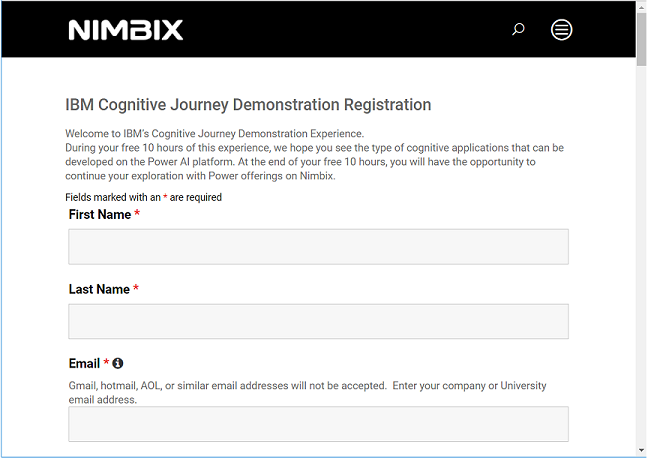
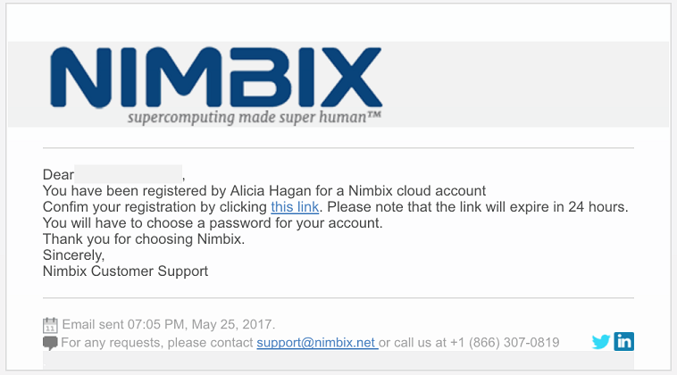
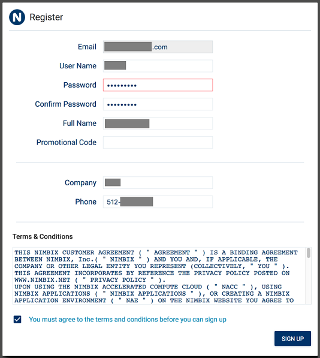
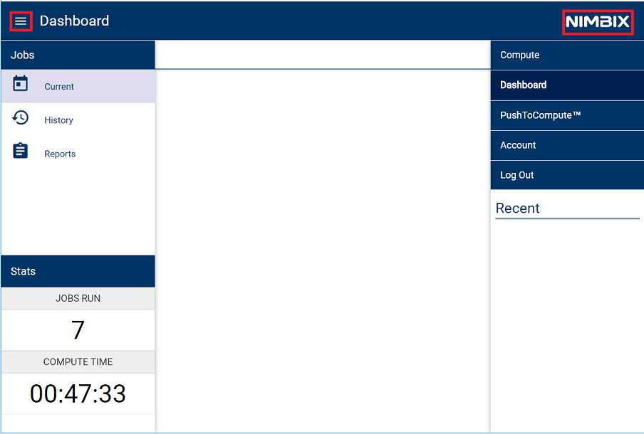
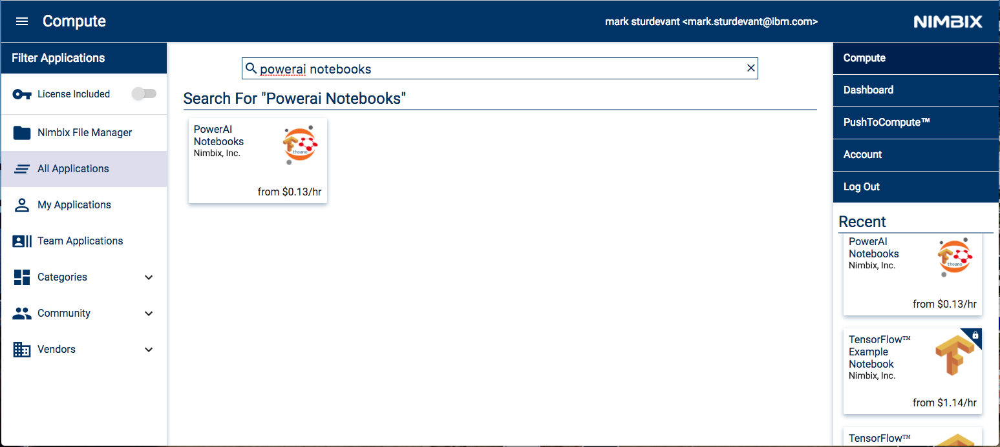
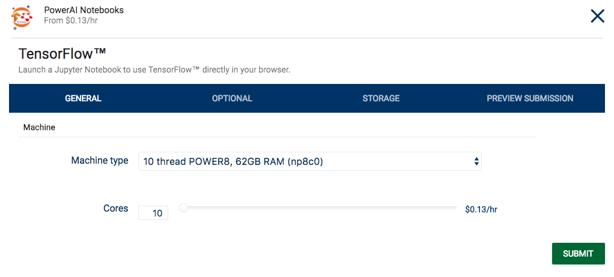
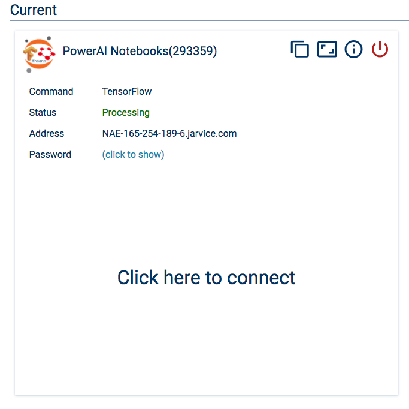
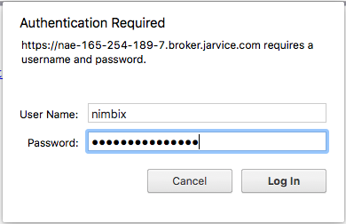

# Image recognition training with TensorFlow Inception and transfer learning

Transfer learning is the process of taking a pre-trained model (the weights and parameters of a network that has been trained on a large dataset by somebody else) and “fine-tuning” the model with your own dataset. The idea is that this pre-trained model will act as a feature extractor. You will remove the last layer of the network and replace it with your own classifier (depending on what your problem space is). You then freeze the weights of all the other layers and train the network normally (Freezing the layers means not changing the weights during gradient descent/optimization).
For this experiment we used Google's Inception-V3 pretrained model for Image Classification. This model consists of two parts:
- Feature extraction part with a convolutional neural network.
- Classification part with fully-connected and softmax layers.

The pre-trained Inception-v3 model achieves state-of-the-art accuracy for recognizing general objects with 1000 classes. The model extracts general features from input images in the first part and classifies them based on those features in the second part.
We will use this pre-trained model and re-train it it to classify houses with or without swimming pools.


## Included components

* [IBM Power AI](https://www.ibm.com/ms-en/marketplace/deep-learning-platform): A software platform that includes the most popular machine learning frameworks with IBM Power Systems.
* [IBM Power Systems](https://www-03.ibm.com/systems/power/): IBM Power Systems is IBM's Power Architecture-based server line, built with open technologies and designed for mission-critical applications.
* [Nimbix Cloud Computing Platform](https://www.nimbix.net/): An HPC & Cloud Supercomputing platform enabling engineers, scientists & developers, to build, compute, analyze, and scale simulations in the cloud

## Featured technologies

* [Jupyter Notebooks](http://jupyter.org/): An open-source web application that allows you to create and share documents that contain live code, equations, visualizations and explanatory text.
* [Tensorflow](https://www.tensorflow.org/): An open source software library for numerical computation using data flow graphs.

# Steps

Follow these steps to setup and run this developer journey. The steps are
described in detail below.

1. [Register for a Trial Nimbix Cloud Platform account](#1-register-for-a-trial-nimbix-cloud-platform-account)
2. [Navigating the Nimbix UI](#2-navigating-the-nimbix-ui)
3. [Deploy and run the PowerAI Notebooks application](#3-deploy-and-run-the-powerai-notebooks-application)
4. [Access and start the Jupyter notebook](#4-access-and-start-the-jupyter-notebook)
5. [Run the notebook](#5-run-the-notebook)
6. [Analyze the results](#6-analyze-the-results)
7. [Save and share](#7-save-and-share)
8. [Shut down the PowerAI Notebooks job](#8-shut-down-the-powerai-notebooks-job)

## 1. Register for a Trial Nimbix Cloud Platform account

IBM has partnered with Nimbix to provide journey developers a trial
account that provides 10 hours of free processing time on the PowerAI
platform.

The registration process is as follows:

* Go to the [IBM Cognitive Journey Demo Registration Page](https://www.nimbix.net/cognitive-journey)
and submit the form to initiate the registration process.



* Wait for a confirmation email. Note that this process is not automated so
it may take up to 24 hours to be reviewed and approved.
* Once you receive the email, you will have 24 hours to complete the process
by clicking on the provided link:



* The above link will take you to this page where you need to create and
confirm your account password:



> *NOTE:* A "Promotional Code" is not required.

* Wait for a confirmation email that will will provide instructions
for logging into Nimbix:


* Click the [link](https://mc.jarvice.com?page=compute&team) to take you to
the Nimbix login page:


## 2. Navigating the Nimbix UI

The Nimbix UI has two main controls located at the top of the panel.



* Click on ``NIBMIX`` to display a drop-down list of available modes. Click
again to hide the list. In the example view above, we have selected
the ``Dashboard`` mode.

* On the left-side, click on the ``collapsible`` icon to display a
drop-down list of views that are associated with the selected mode.
Click on the icon again to hide the list. In the example above, we have
selected the ``Current Jobs`` dashboard view.

## 3. Deploy and run the PowerAI Notebooks application

Once signed into Nimbix, deploy the PowerAI Notebooks application.

* Search for and select the ``PowerAI Notebooks`` application in the list
of available apps in the ``Compute:All Applications`` view.



* From the ``PowerAI Notebooks`` application panel, click the
``TensorFlow`` button:


* From the ``TensorFlow`` configuration panel, accept all default values and
click the ``Submit`` button:



> *NOTE:* Ignore the $/hr charge listed. With your trial account you receive 10 hours of free processing time.

* Once started, the following ``Dashboard`` panel will be displayed. When
the server ``Status`` turns to ``Processing``, the server is ready to be
accessed.

    Click on ``(click to show)`` to get the password.

* Click ``Click here to connect`` to launch web access to the notebooks.



* Log-in using the user name ``nimbix`` and the previously supplied password.



## 4. Access and start the Jupyter notebook

Use git clone to download the example notebook, dataset, and retraining library with a single command.

* Get a new terminal window by clicking on the ```New``` pull-down and selecting ``Terminal``.


* Run the following command to clone the git repo:

```commandline
git clone https://github.com/IBM/powerai-transfer-learning
```


* Once done, you can exit the terminal and return to the notebook browser. Use the ``Files`` tab and click on ``powerai-transfer-learning`` then ``notebooks`` and then ``Classifying-House-And-Pool-Images.ipynb`` to open the notebook.


## 5. Run the notebook

When a notebook is executed, what is actually happening is that each code cell in
the notebook is executed, in order, from top to bottom.

Each code cell is selectable and is preceded by a tag in the left margin. The tag
format is `In [x]:`. Depending on the state of the notebook, the `x` can be:

* A blank, this indicates that the cell has never been executed.
* A number, this number represents the relative order this code step was executed.
* A `*`, this indicates that the cell is currently executing.

There are several ways to execute the code cells in your notebook:

* One cell at a time.
  * Select the cell, and then press the `Play` button in the toolbar.
* Batch mode, in sequential order.
  * From the `Cell` menu bar, there are several options available. For example, you
    can `Run All` cells in your notebook, or you can `Run All Below`, that will
    start executing from the first cell under the currently selected cell, and then
    continue executing all cells that follow.


## 6. Analyze the results

When you run the "Main" code cell you can watch the training as the accuracy
quickly improves. At the end, the final test accuracy is shown. We usually see
somewhere around 85% accuracy with these images.


We captured the model before and after the training. Look at our example
images at the bottom of the notebook and see our before and after results.


The results should go from no recognition ability at all to a pretty good
success rate. You might find it interesting to try different images and see
if you can identify why it has more difficulty classifying some images.

## 7. Save and share

### How to save your work:

Because this notebook is running temporarily on a Nimbix
Cloud server, use the following options to save your work:

Under the `File` menu, there are options to:

* `Download as...` will download the notebook to your local system.
* `Print Preview` will allow you to print the current state of the
  notebook.

## 8. Shut down the PowerAI Notebooks job

Remember to shutdown the server to free up resources on the Nimbix Cloud Platform. Also, remember that
the free trial registration only provides 10 hours of compute time.

* From the Nimbix ``Dashboard:Current Jobs`` view, click on the
``Shutdown`` button and confirm.

# Troubleshooting

[See DEBUGGING.md.](DEBUGGING.md)

# License

[Apache 2.0](LICENSE)
